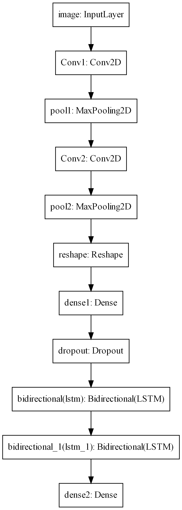

# Captcha
Captcha Recognition Using CRNN

Implementation of Convolutional Recurrent Nerual Network for Captcha Recognition.

Dataset:
[CAPTCHA Images](https://www.kaggle.com/fournierp/captcha-version-2-images)

Research Paper:
[An End-to-End Trainable Neural Network for Image-based Sequence
Recognition and Its Application to Scene Text Recognition
](https://arxiv.org/pdf/1507.05717.pdf)

